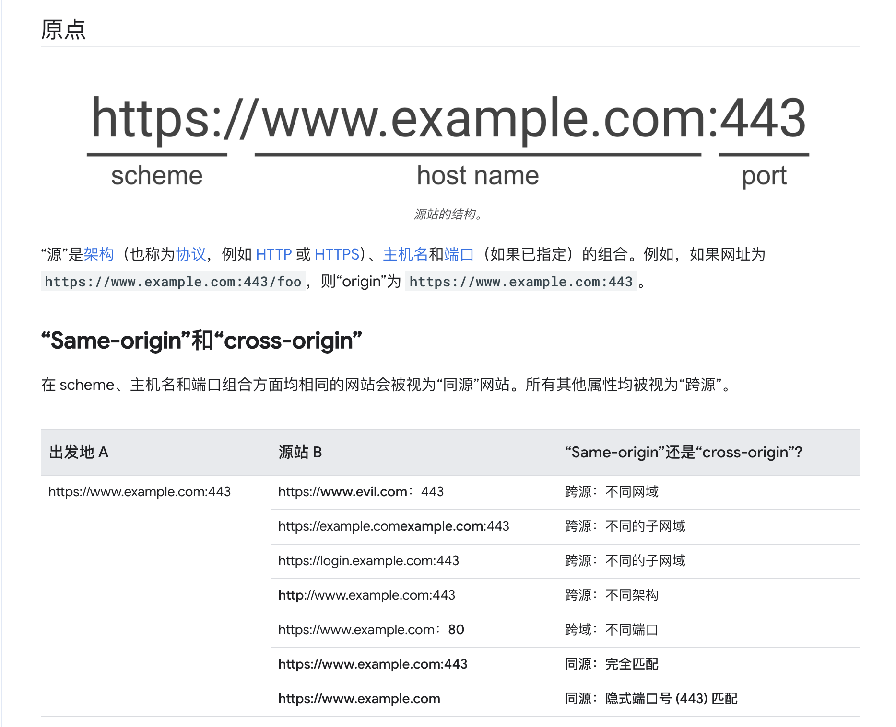
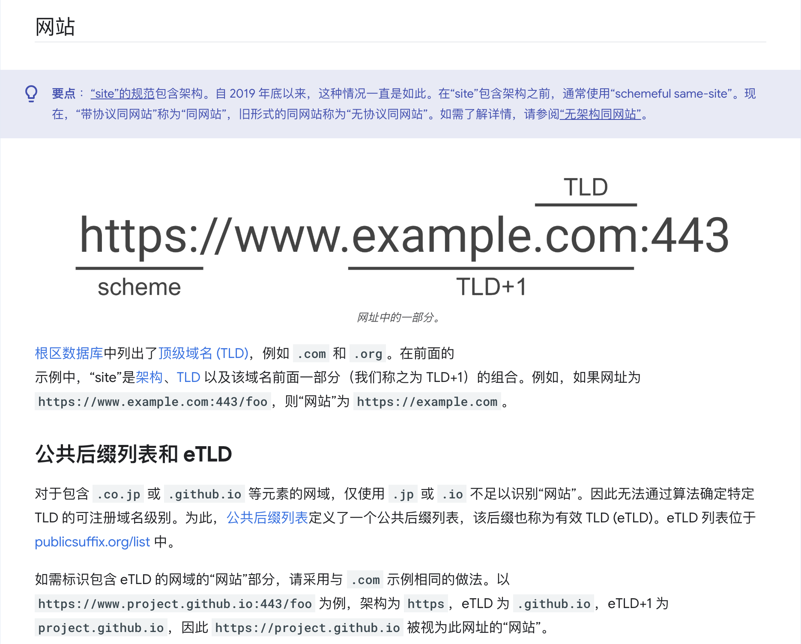
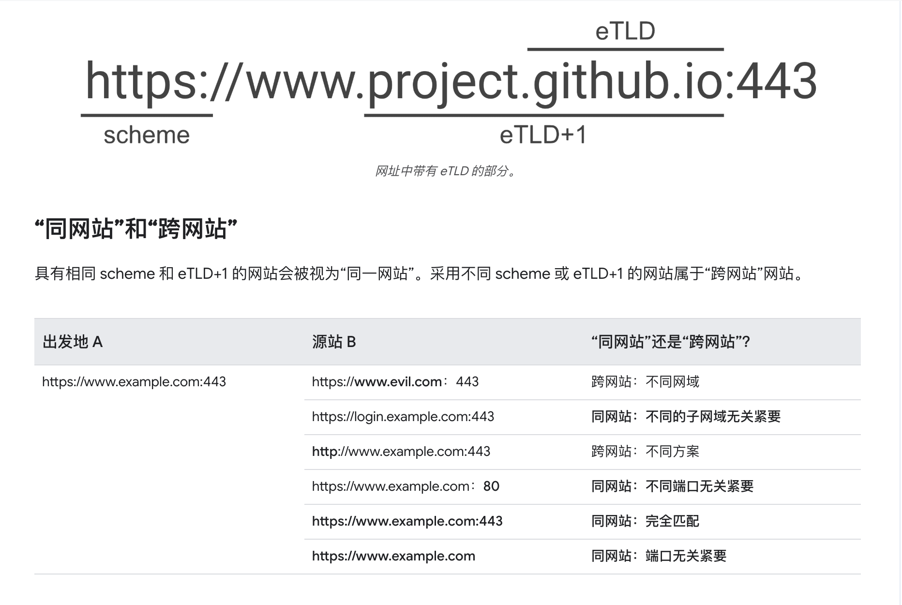
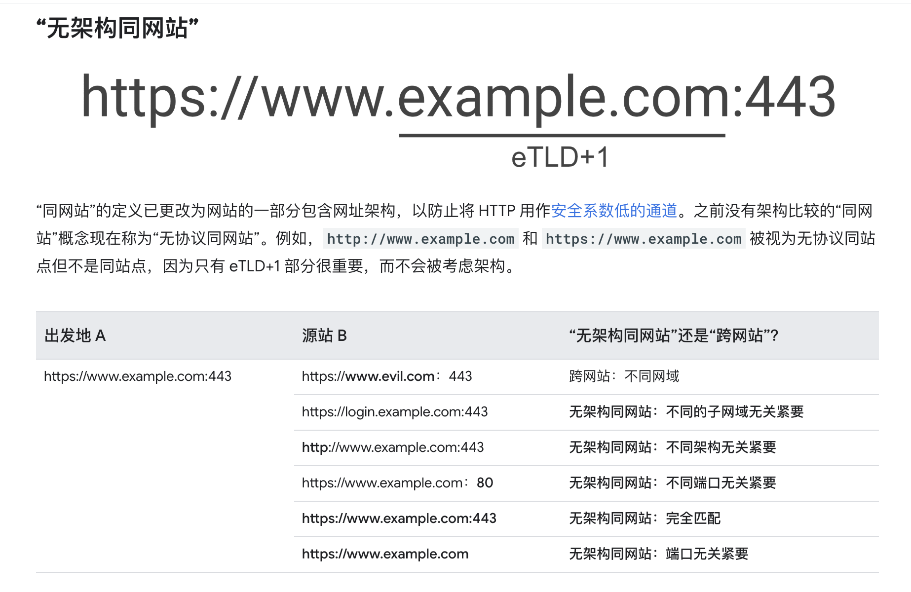
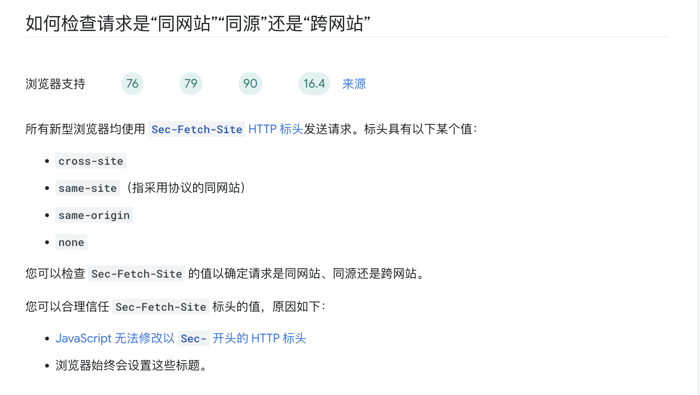

# Micro-Front-End-Solution
微前端解决方案事例
### 同源&跨源
同源：协议（protocol）、主机名（host）和端口（port）相同，则为同源；

### 同站&跨站
同站：协议（protocol）、有效顶级域名（Effective Top-Level-Domain，eTLD）和二级域名相同(eTLD + 1 )，则为同站。

#### 无架构同站

### 检查请求是同源还是同站

参考地址：https://web.dev/articles/same-site-same-origin?hl=zh-cn